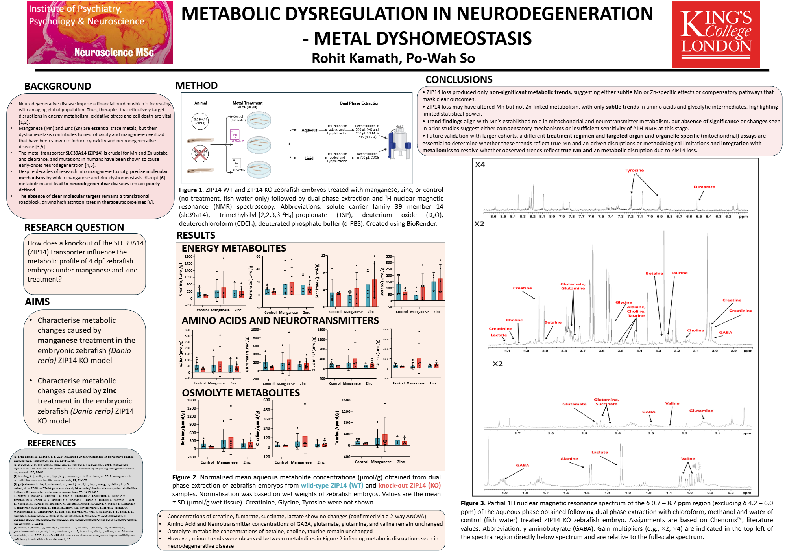
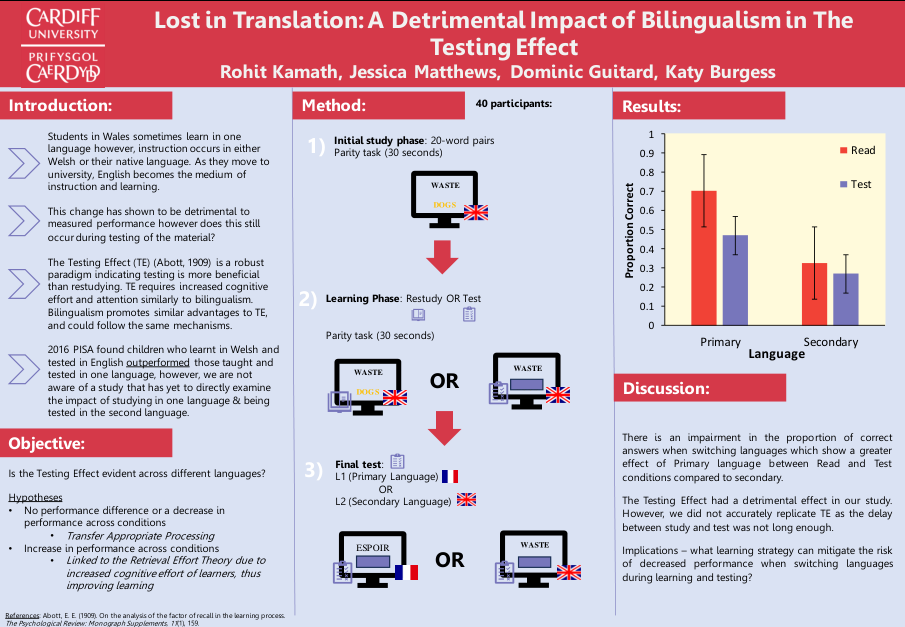

## Hi there

I'm Rohit, I leverage expertise in statistical modeling and experimental design to uncover patterns in complex datasets. I focus on transforming raw data into clear, actionable insights through rigorous analysis and visualization.

I am passionate about applying data-driven strategies to solve real-world problems using real-world evidence, to bridge the gap between  research and actionable patient and public insights. Eager to collaborate on projects that utilize predictive modeling and data storytelling to improve patient and people's wellbeing.

---
### Effect of Metal Dyshomeostasis on Metabolomics in Neurodegeneration: An NMR Spectroscopy Study (2025)

#### Aim: Characterise metabolic changes in an animal model across 2 treatments to identify potential molecular targets in neurodegeneration. 

- Experimental Design: NMR Sample Prep and Extraction
- Protocols: Designed 3 for NMR sample prep, analysis and processing
- Visualization: Excel and R
- Dissemination: PowerPoint and Word for Reporting
  

[Download Full Resolution Poster PDF](./Rohit%20Kamath_Poster2025.pdf)

---

###  Lost in Translation: A Detrimental Impact of Bilingualism in the Testing Effect (2022)

#### Aim: Design and run a prospective study to establish whether the Testing Effect was evident across English and French bilingual speakers. 

- Experimental Design: C in PsyToolkit
- Data Analysis: JASP (SPSS analogue)
- Visualization: R
- Dissemination: PowerPoint and Word for Reporting

[Download Full Resolution Poster PDF](./POSTER.pdf)
